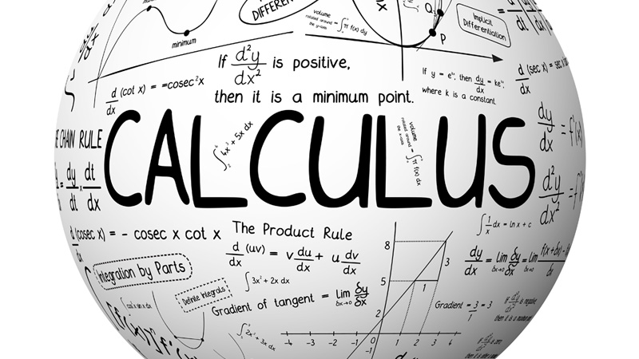

# Oppgaver i MAT1100 - Kalkulus ved UiO

>Dette er en samling av plenumsregninger og oppgaver regnet av nåværende eller tildigere faglærere i MAT1100 ved Universitetet i Oslo. Plenumsregningene er fra 2011 til 2017 så mange av oppgavene vil være de samme. Der plenumsregningene har dekket flere kapitler, er filene splittet opp slik at kun kapittel 4 oppgaver ligger under kapittel 4 osv.

 Samlingen er tiltenkt for å hjelpe studenter med å spare tid/få oversikt over tidligere plenumsregninger og oppgaver som er regnet i kurset.

 Man kan finne de orginale filene [her](http://www.uio.no/studier/emner/matnat/math/MAT1100/).
 ___

 *Tags; Løsningsforslag Kalkulus, Løsninger MAT1100 Kalkulus, Samling av løsninger i MAT1100 Kalkulus, Solutions MAT1100 Kalkulus.*

 -Eirik Kvalheim
